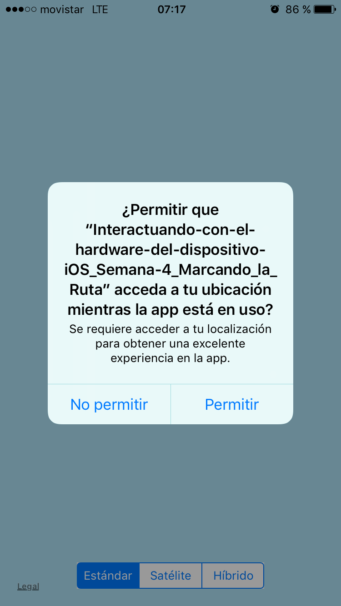

# Marcando la Ruta
Tarea "Marcando la Ruta" del curso "Interactuando con el hardware del dispositivo iOS" que se lleva en el portal Coursera.
## Instrucciones
### Proyecto
Hacer una aplicación en Swift que se pueda correr en el simulador de iOS usando Xcode. Esta aplicación, cuando el usuario se mueva, deberá ir marcando con pines sobre un mapa, la ruta que el usuario sigue. Cada pin deberá contener en el Título, su posición en latitud y longitud, y en su Subtítulo, la distancia recorrida hasta ese momento.

### Descripción
Hacer una aplicación en Swift que se pueda correr en el simulador de iOS usando Xcode y que permita:

**NOTA:** Como el programa corre en el simulador se debe seleccionar la opción de “Paseo en bicicleta” por lo que supondrá que la posición actual del dispositivo es Cupertino, CA, USA. Si el programa se corre en un dispositivo, marcará la ruta real seguida por el usuario.

- Ponga un mapa en la pantalla.
- Permita cambiar el tipo de mapa que muestra (normal, satélite o híbrido) mediante 3 botones o el mecanismo que usted desee.
- El mapa debe estar centrado en la posición actual del dispositivo.
- El mapa debe tener un zoom in en el que se puedan ver las calles de la ciudad (usted decide cuánto es).
- Pedir autorización para leer la posición del dispositivo.
- Muestre la posición actual del dispositivo en todo momento (punto azul).
- Cada vez que el dispositivo se mueva a más de 50 metros del punto actual, deberá colocar un pin.
- El pin debe tener como título, la posición en (longitud, latitud).
- El pin debe tener como subtítulo, la distancia recorrida hasta el momento.
  
### Entrega
- El proyecto se debe hacer en forma individual.
- El proyecto se deberá colocar GitHub.
- Se debe escribir la liga para bajarlo.

## Criterios de revisión
Selecciona la opción que más describa el trabajo que estás revisando.

**NOTA:** Los programas deben estar hechos en Swift para que se puedan calificar. De no ser así se debe asignar una calificación de cero puntos en todo.

## Resultado
Se muestra la pantalla del iPhone 6 al ejecutar el programa (hacer click en la imagen para ver la ejecución):

Todas las funcionalidades fueron realizadas, así se ponen pines cada vez que el usuario se mueve más de 50 metros. En seguida se muestra la autorización que se pide la primera vez que se abre la aplicación:

***
Juan Carlos Carbajal Ipenza
